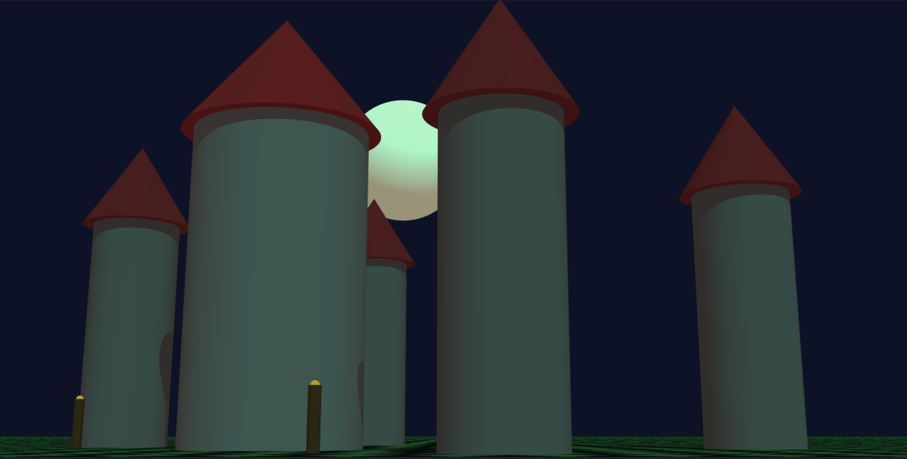

# TEST:

we can preview the image without having sfml for now 

from root do this:
`make &&
./raytracer scenes/whatever.cfg &&
./render.sh output.ppm
`
then the png will be rendered in screenshots/

# TODO
- SHOULD:

  - rotation (parsed but not implemented yet)
- extra important stuff tho but at the end

  - anti aliasing supersampling

# DONE

- primitive factory ✅
- light factory ✅
- parser (jad) ✅
- MUST:
  - sphere intersection ✅
  - plane intersection ✅
  - camera ray generation ✅
  - transformation ✅

- SHOULD:
  - cylinder intersection ✅
  - cone intersection ✅
  - drop shadows ✅

- EXTRA IMPORTANT STUFF:
  - multithreading ✅

## PREVIEW

