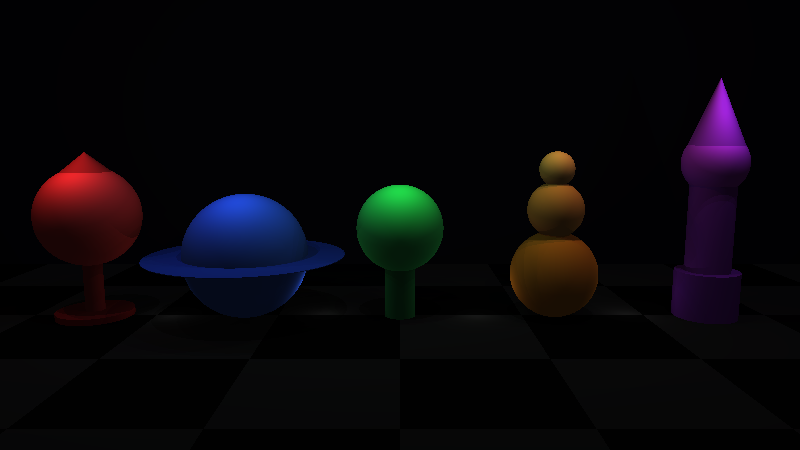

# Raytracer


This C++ multithreaded program can generate a raytraced scene from a specific config file.

## Build

```bash
make # compiles the program
make fclean # removes the compiled files
```

## Usage

```bash
./raytracer <path_to_scene_file>
./render.sh  <path_to_scene_file> # if you don't have SFML installed
```

## ⚠️ Notes
Please be careful when using the program, as it uses multithreading to render scenes. If you have a low-end computer, it is advised you lower the width and height values inside the .cfg files you want to render. Anything below 1000 is ok.

## Concepts

This project envolves the creation of several primitive forms as objects, as well as the completion of design patterns.


